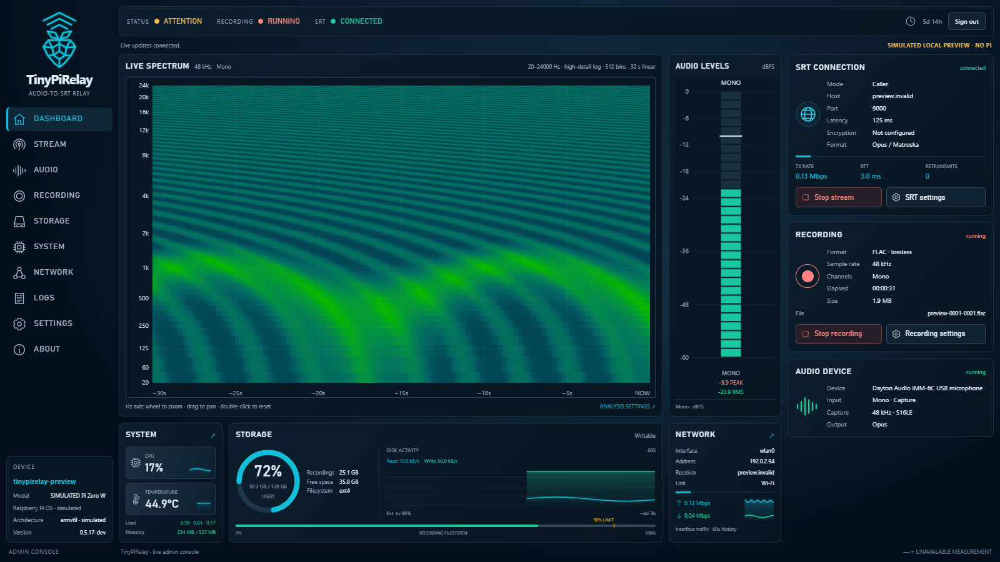

# TinyPiRelay

Turn a Raspberry Pi into a browser-controlled audio recorder and streaming device.
Watch live audio levels and a spectrogram, record lossless FLAC, manage your
recordings, and send audio to a compatible SRT receiver—all from one dashboard.
The Pi can run without its own screen; open the web GUI from another computer.

**Development prerelease · 0.5.17-dev · MIT licensed.**
For controlled evaluation, not yet an unattended recording appliance.
[Current limitations](#status-and-limitations) · [Quick install](#quick-install) ·
[First recording](docs/GETTING_STARTED.md) ·
[Releases](https://github.com/gall-levi-code/TinyPiRelay/releases)



*Actual TinyPiRelay web UI with simulated sample data; no Pi connection.
The readings and “SIMULATED Pi Zero W” label are illustrative, not hardware
performance evidence. [Screenshot details](docs/screenshots/README.md).*

## What you can do

- **Monitor audio:** a linear 30-second spectrogram, per-channel meters,
  adjustable frequency bounds, axis zoom/pan, and spectrum/meter color choices.
- **Record locally:** native FLAC, timed file rotation, and a recording cutoff
  at 90% filesystem usage.
- **Manage recordings:** paginated files, browser playback and seeking where
  FLAC is supported, original downloads, checks, and confirmed deletion.
  Recovery attempts a separate copy; it preserves the original but cannot
  recreate missing audio.
- **Stream audio:** send to a compatible receiver using SRT while monitoring
  and recording. Streaming and recording have separate start/stop controls.
- **Manage the appliance:** inspect CPU, temperature, memory, disk and network
  telemetry; view recent events; change your web password; and confirm
  service restarts, reboot or shutdown from the GUI.

Useful for audio-monitoring and field-recording experiments, or as the capture
end of a remote listening/analysis setup. TinyPiRelay does not itself identify
birds or include a receiving server.

## What you need

| Component | Start here |
|---|---|
| Raspberry Pi | Pi 4 B is the current evaluation target; other boards are not blanket-supported. |
| Operating system | Raspberry Pi OS Bookworm or Trixie; Trixie 64-bit for the current Pi 4 setup. |
| Audio input | A device and capture mode listed as validated in the GUI. You can install before connecting one. |
| Power and storage | Suitable Pi power supply, reliable storage, and free space for recordings. |
| Network | Internet access for installation; a trusted LAN for normal web access. |
| Browser | Desktop or large tablet, at least 1160 × 720. Phone layouts are not supported. |

Audio discovery is not universal USB-microphone compatibility: only validated
device/mode combinations are admitted. See the
[first-use guide](docs/GETTING_STARTED.md#2-select-and-apply-an-audio-input) and
[hardware evidence and planning matrix](docs/HARDWARE_MATRIX.md).

## Quick install

For a **fresh device**. Already installed? Follow the
[upgrade guide](docs/INSTALLATION.md#existing-installations-upgrades-and-rollback).

1. Flash **Raspberry Pi OS Bookworm or Trixie**. In Imager, configure a unique
   hostname, networking, an OS administrator and SSH. No microphone or
   TinyPiRelay configuration file is required.
2. Connect using `ssh <admin-user>@<hostname>.local` or the Pi's IP address.
3. Paste this **into the Pi's SSH terminal**, not Windows PowerShell.
   It installs Git and HTTPS certificates if missing, clones the selected
   release, then runs the installer to install prerequisites and start services:

   ```sh
   sudo apt-get update && sudo apt-get install -y --no-remove --no-upgrade git ca-certificates && git clone --depth 1 --branch v0.5.17-dev https://github.com/gall-levi-code/TinyPiRelay.git && sudo /bin/sh TinyPiRelay/install.sh install --apply
   ```

4. Open `http://<hostname>.local/` or `http://<device-ip>/`—no special port.
   Create your web username and password (at least 12 characters), then sign in.
   This account is separate from your SSH account.

Run the command from a writable directory without an existing `TinyPiRelay`
folder. A failed package command or clone stops the chain; an existing nonempty
checkout is not overwritten. If the installer fails after cloning, follow
[installation troubleshooting](docs/GETTING_STARTED.md#if-something-does-not-work) rather
than deleting the folder or blindly rerunning the clone.

Review and trust the [release](https://github.com/gall-levi-code/TinyPiRelay/releases/tag/v0.5.17-dev)
before granting root access. This method trusts GitHub and the selected tag over
HTTPS; it does not verify an independent release signature.
[Manual/checksum-verified installation](docs/INSTALLATION.md#download-verify-and-install)
is also available.

**Trusted LAN only:** HTTP passwords and sessions are unencrypted. The first
visitor to an unconfigured device can create its administrator account.
Complete setup promptly on a trusted network, or choose
[SSH-only access](docs/INSTALLATION.md#lan-access-and-first-account-security).
Do not expose the web GUI directly to the Internet.

## Make your first recording

Start in **Audio**: refresh inputs, choose a validated capture mode, save, and
apply the required media restart. Check the **Dashboard** meters, make a short
recording, stop it normally, then open **Storage** to play or download the file.
The [step-by-step first-use guide](docs/GETTING_STARTED.md) explains the controls
and what to check when something is unavailable.

### Audio controls

Select capture settings and adjust the spectrogram's frequency view and colors.
View zoom changes what you see, not the microphone's recorded resolution.


### Recording library

Play, download and check finished recordings from **Storage**. Active files are
protected; recovery creates a separate copy instead of editing the original.


*Both screenshots use the actual interface with simulated telemetry and sample
recordings. They are not recordings from a microphone or proof of hardware operation.*

## Sending audio to another system

TinyPiRelay is the **sender**. You need a separately configured receiver that
accepts **streamable Matroska over SRT**, using TinyPiRelay in caller mode.
The admitted stream formats are 48 kHz stereo PCM S16LE, FLAC, and Opus.
Local capture/recording can use a different format; the current FLAC stream
path is 16-bit, including when native local recording is 24-bit.

MPEG-TS is not currently produced. An SRT input on another product does not
automatically mean it accepts this framing and codec combination. A finite
[BirdNET integration test](docs/evidence/RPI4_S24_FLAC_BIRDNET_2026-09-09.md)
used an additional receiving bridge; that bridge is not bundled.
See [first stream setup](docs/GETTING_STARTED.md#optional-send-audio-over-srt).

## Status and limitations

- **Fresh installation still needs physical validation:** `0.5.17-dev` adds
  browser account creation, no-microphone deployment and LAN port 80.
  Its new onboarding flow, port-80 service operation and hostname discovery
  have not yet passed a fresh physical-Pi installation check.
- **Pi 4 evidence is finite:** a 30-minute combined recording, monitoring,
  streaming and BirdNET run passed on an earlier release. That is not
  endurance, kiosk or power-loss acceptance.
- **Original Zero W is constrained:** the later dashboard workload saturated
  the board. Do not treat earlier narrow tests or the screenshot's simulated
  readings as approval for the full workload.
- **Not all controls imply available hardware:** battery readout and GUI Wi-Fi
  setup are unavailable. Other receiver combinations, encrypted SRT,
  hotplug recovery and broad board support need further validation.
- **Keep backups:** normal stop finalizes recordings; recovery cannot guarantee
  complete audio after a power cut. Unattended archival reliability is not claimed.

The [release-readiness report](docs/RELEASE_READINESS.md) records open gates.
[Project history and evidence](docs/PROJECT_STATE.md) retain earlier versions and
test scopes; those historical results do not certify the current prerelease.

## Help and development

- [First use and troubleshooting](docs/GETTING_STARTED.md)
- [Installation, upgrades, password reset and removal](docs/INSTALLATION.md)
- [FLAC recovery and its limits](docs/FLAC_RECOVERY.md)
- [Developer checks and architecture](docs/DEVELOPMENT.md)
- [Report a bug or request a feature](https://github.com/gall-levi-code/TinyPiRelay/issues)

For a useful bug report, include the TinyPiRelay version, board, OS/32- or 64-bit
architecture, audio device/mode, browser, reproduction steps, and expected versus
actual behavior. Review logs before sharing; remove passwords, tokens, private
addresses and personal recording details. No hardware or fix-time guarantee is
implied by a community report.

## License

[MIT](LICENSE). TinyPiRelay is an independent project, not affiliated with or
endorsed by Raspberry Pi. Its geometric logo is original artwork.
