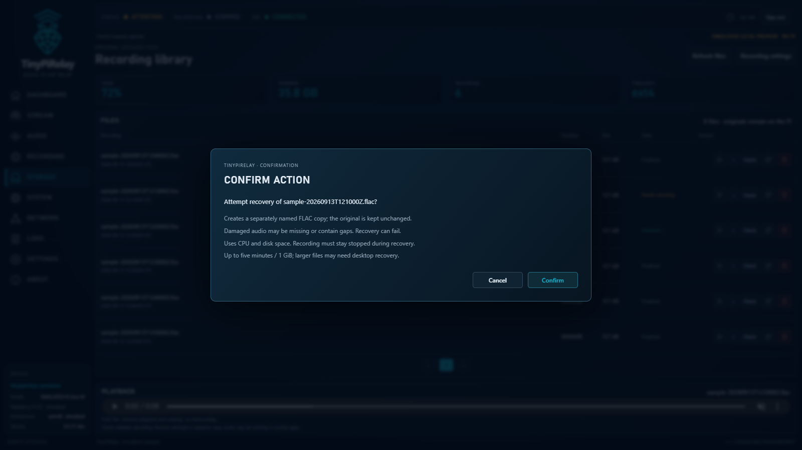

# FLAC recovery copies

Installed as `0.5.16-dev` on the Pi 4. A finite real web-API recovery check passed
through the installed service; see [deployment evidence](evidence/RPI4_FLAC_RECOVERY_2026-09-11.md).
Normal capture, streaming and recording still use GStreamer.
Recovery alone needs the distribution's `ffmpeg` executable. It was separately
installed for `0.5.16-dev`; the `0.5.17-dev` onboarding installer includes it in
automatic prerequisites. It is not bundled, and missing FFmpeg still disables
the button with an explanation. Recovery adds no privileged action.

## Using Storage

Stop recording, select the recovery icon beside **Check**, and confirm the
TinyPiRelay prompt. The media service attempts to salvage decodable FLAC frames
into a separately named `tinypirelay-recovered-<timestamp>-<random>.flac` in the
same configured recording directory. It never overwrites or edits the original.
Progress and the final outcome appear in the file state; the result includes
the copy's name. Once published, the copy supports the normal playback,
download and delete controls.



*Actual confirmation dialog with simulated sample data, after stopping the
preview recording. The prompt was cancelled; no recovery was run for this image.*

This can help with interrupted finalization, truncated tails and damaged
frames when enough metadata/audio remains decodable. It cannot reconstruct
lost samples or guarantee the complete original recording. Corrupt frames
are skipped, so audio may have missing sections. Unreadable headers or severe
damage can make recovery fail. A recovered-copy result never marks the original
as repaired. Keep it for further investigation.

## Safety and limits

- A single shared check/recovery job runs at once. Recording must remain stopped;
  starting recording, changing its configuration, changing the source file or
  losing the configured destination cancels the attempt. Capture/SRT are not
  intentionally stopped. Decoder and encoder use one thread each and lower
  CPU priority where `nice` is available; Pi performance is not yet measured.
- Total job time is capped at five minutes, including validation. Output is
  capped at 1 GiB and available space below the existing 90% recording cutoff,
  with a further 16 MiB reserve. Limit exhaustion fails instead of publishing
  an intentionally shortened copy. Use a desktop for larger/slower recoveries.
- The source is a version-bound, read-only, no-follow file descriptor. The output
  is a new exclusive mode-0600 hidden `.partial` file in the media-owned directory.
  No user filename becomes a shell command or FFmpeg input/output path.
- After encoding, the output must contain positive-duration audio and preserve
  known source sample rate, channel count and depth. The initial recovery supports
  16-, 24- and 32-bit output only when the installed FFmpeg preserves that depth.
  A second strict decode must pass and its PCM MD5 must match the new FLAC's
  STREAMINFO checksum. This validates the copy, not missing original audio.
- The validated output is fsynced and published without replacing any existing
  filename. Directory-sync failure reports uncertain durability. Normal failures
  remove only this job's temporary output. A process crash or failed cleanup can
  leave a hidden `.partial`; inspect it manually, not as a finalized recording.
- The deadline bounds userspace/process work, not an indefinitely blocked kernel
  filesystem operation. No power-cut durability or unattended archival guarantee
  is claimed. There is no automatic repair or automatic original deletion.

## API

Authenticated, CSRF-protected `POST /api/storage/action` accepts
`{"action":"recover","file_id":"<current opaque ID>"}`. The response is
`{accepted, check}`; the existing local protocol forwards `storage.recover`.
File rows include `can_recover` and `recovery_unavailable_reason`. The shared
`check` object reports `action: "recover"` and `recovering`, `recovered`, `failed`,
`cancelled`, `timeout` or `unavailable`; success includes `output_name` and
`durability_confirmed`. The catalog's top-level `check` retains the running or
most recent job, including when its source row moves to another page.
Results are bounded in memory and reset when the media service restarts.

## Finite validation

Synthetic fixtures only; no user recordings, Pi packages, service actions or
endurance runs are needed for these checks. The implementation reuses the
existing media-owned library and job slot, without a new service or Python
dependency. Optional real integration tests run when FFmpeg is installed:

```sh
PYTHONPATH=src python3 -B -m unittest discover -s tests -p 'test_recording_recovery.py' -v
node tests/web_dashboard_checks.js
```

On 2026-09-11, all 15 recovery tests passed in 1.129 seconds with FFmpeg 8.1.2
installed only inside a disposable Python 3.12 Alpine container. This includes
four real 16-/24-bit truncation/finalization cases, a real empty-file rejection,
and mocked cancellation, space, checksum, publication and descriptor failures.
The Windows full suite passed 472 tests in 53.413 seconds (49 Linux/tool skips).
The final network-disabled Linux suite passed 472 tests in 77.016 seconds
(four missing-tool skips; the two real FFmpeg tests passed separately above).
Offline dashboard checks and Firefox 134/Chromium 133 mocked browser checks
passed all ten routes at three desktop sizes, including both-theme confirmation
and a successful recovery moving the source row onto another page.

The first full-suite runs exposed an outdated HTML assertion that treated the
dialog's two `aria-describedby` IDs as one ID. The test now validates each
referenced ID; accessibility references were retained, not removed to pass.

Independent command experiments passed on FFmpeg 8.0.1 (Windows) and 7.1.5
(disposable Linux container): 16-bit/44.1 kHz mono and 24-bit/48 kHz stereo
retained their formats; truncation and bad-frame fixtures produced independently
decodable copies with matching PCM checksums. A header-only file returned decoder
success but no samples, confirming why positive sample count is required. A
copy truncated at a frame boundary still decoded successfully but failed the
checksum, confirming why decoder exit status alone is insufficient.

Implementation references: [FFmpeg file protocol](https://ffmpeg.org/ffmpeg-protocols.html#file),
[decoder error controls](https://ffmpeg.org/ffmpeg-codecs.html#Codec-Options), and
[FLAC decoder CRC handling](https://github.com/FFmpeg/FFmpeg/blob/n5.1.7/libavcodec/flacdec.c).
Recovery uses strict CRC/frame rejection without `-xerror`; the validation pass
does use `-xerror`. `ignore_err` is deliberately not used because experiments
showed it could keep corrupt samples.
