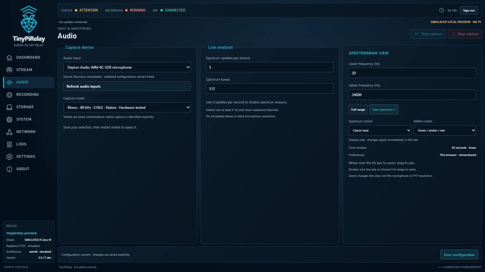
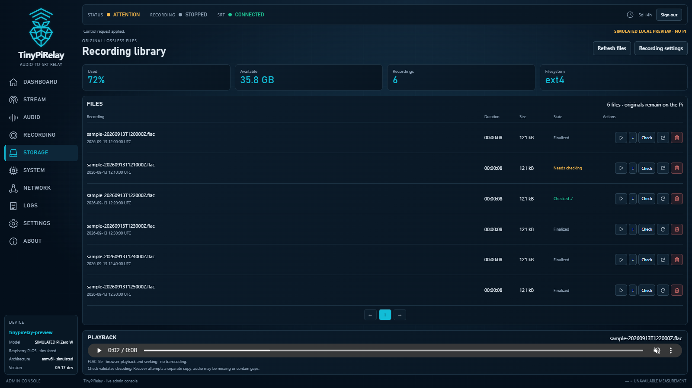

# Your first TinyPiRelay recording

Start here after [installation](INSTALLATION.md). This guide follows the
`0.5.17-dev` development prerelease; fresh-device onboarding still needs physical-Pi
validation. Use a desktop or large tablet with a browser viewport of at least
1160 × 720. Phone layout is not supported.

## 1. Create your web account

Open `http://<hostname>.local/` or `http://<device-ip>/` on your trusted LAN.
Use your Pi's hostname or IP address.

At **Create your account**, choose a username and a password of at least 12
characters, confirm the password, and select **Create account**. Then **Sign in**
with those credentials. Existing installations show the sign-in screen directly.
This account is separate from your SSH/OS account; there is no default password.

HTTP does not encrypt passwords or sessions. Set up promptly on a trusted
network: the first visitor can claim an unconfigured device. For SSH-only access,
follow the [SSH tunnel instructions](INSTALLATION.md#lan-access-and-first-account-security).

## 2. Select and apply an audio input

1. Connect your microphone or interface. Open **Audio → Refresh audio inputs**.
2. Choose **Audio input**, then an exact **Capture mode**. The lists identify
   validated combinations; detecting a USB device does not validate it.
3. For the first local recording, leave **Stream → Start with the media service**
   unchecked. No receiver or stream destination is needed.
4. Select **Save configuration** and confirm the restart-required change.
5. Open **Settings → Apply saved settings / restart media**. Enter your current
   web password and confirm. Wait for the device to reconnect.

For example, the Dayton Audio iMM-6C has validated native mono modes at 48 kHz:
**S16LE** (16-bit) and **S24LE** (24-bit). The Scarlett Solo 3rd Gen. has a listed
48 kHz stereo **S24_32LE** software-converted capture mode with no approved stream
option. Other devices and arbitrary format/rate combinations are not implied.
See the [hardware matrix](HARDWARE_MATRIX.md) for evidence boundaries.

*Actual interface with simulated sample data; no Pi connection.*

## 3. Verify sound and record a short test

Open **Dashboard**. Capture should be running after restart; if stopped, use
**Audio → Start capture**. Speak near the microphone or feed your interface a
signal. **Audio levels** should respond and **Live spectrum** should scroll.
Avoid persistent clipping; check the source level if it occurs.

Open **Recording** and check **Recording directory**. The default is
`/var/lib/tinypirelay/recordings`. Keep it and check available
space in **Storage**; recording stops at 90% filesystem usage.

Select **Start recording**, record 20 seconds, then select **Stop recording**
and confirm. Wait for recording to stop and finalize before accessing the file.
Closing the browser does not stop recording. Local recordings are FLAC at the
selected capture format; changing spectrum colors or zoom does not alter them.

## 4. Listen and download

Open **Storage → Refresh files**. Find your recording and use its **Play**
triangle or **Download** down-arrow. Playback and seeking use your browser's FLAC
support; if playback fails, download the original and use a FLAC-capable player.
Active recordings cannot be played or downloaded. **Check** tests decoding while
recording is stopped; a **Finalized** label alone is not a decoder check.

*Actual interface with sample recordings and simulated telemetry.*

## Optional: send audio over SRT

Provide your own compatible SRT listener; no production receiver is bundled.
In **Stream**, enter its **Host** and **Port**, select an approved **Representation**,
and check **Start with the media service**. Save and apply the media restart as
above; streaming starts with capture. Use **Start stream** if it is stopped.

TinyPiRelay sends streamable **Matroska** over SRT caller mode, not MPEG-TS.
Available PCM, FLAC and Opus options depend on the exact capture mode. The iMM-6C
24-bit mode streams only FLAC converted to **16-bit stereo**; its local FLAC stays
24-bit mono. Stream-ID routing and encrypted-SRT interoperability remain unverified.
See [media transport details](MEDIA_SERVICE.md#transport-isolation-and-reconnect).

## If something does not work

- **Install failed after cloning:** resolve the reported package/network error,
  then retry `sudo /bin/sh TinyPiRelay/install.sh install --apply` from the same
  parent directory, using the release you just cloned. Do not delete recordings
  or re-clone over an existing checkout. If the folder predates your attempt,
  verify its source first using the [install guide](INSTALLATION.md#clone-and-install).
- **Page unavailable:** try the IP address; legacy installations may need the SSH
  tunnel. [Access and diagnostics](INSTALLATION.md#diagnostics-and-removal).
- **No input or meters:** check the connection, refresh inputs, select a validated
  mode, and apply saved settings. A detected unknown device is not supported yet.
- **Start button disabled:** apply pending settings, start capture, and check
  **Logs** for the reported error. Recording also needs writable storage and space.
- **Damaged recording:** keep the original and read [FLAC recovery](FLAC_RECOVERY.md).
- **More help:** [web controls](WEB_CONTROL.md), [release limitations](RELEASE_READINESS.md),
  or [report an issue](https://github.com/gall-levi-code/TinyPiRelay/issues).
  Include version, board, input/mode and the error; remove secrets before sharing logs.
